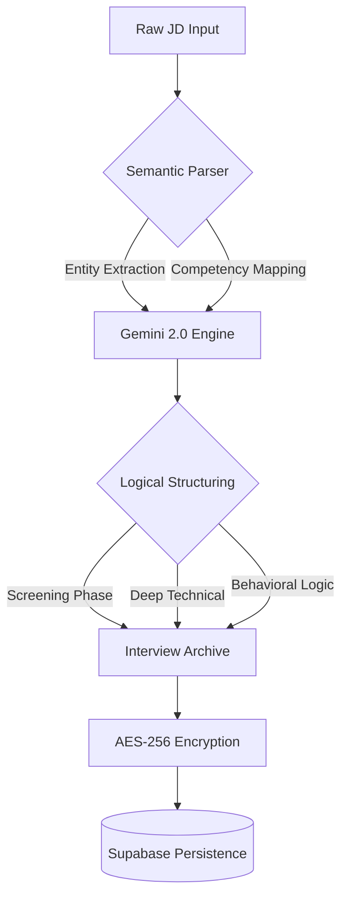

# ⌬ JD2Q // THE INTELLIGENCE PROTOCOL
### *Transforming Job Descriptions into Battle-Tested Interview Blueprints.*


---

## 👁️ System Vision
**JD2Q** is not a simple generator; it is a **Semantic Reconstruction Engine**. In a world where Job Descriptions (JDs) are often vague or overwhelming, JD2Q leverages High-Density LLM logic to reverse-engineer the hiring manager's intent. 

It identifies the **latent technical requirements** and **hidden behavioral expectations** to produce a surgical interview roadmap. Designed for high-stakes preparation, it provides an unfair advantage through precision intelligence.

---

## 🛠️ System Architecture (Protocol 4.0)

### **Intelligence Flow Diagram**


### **The Technology Matrix**
| Layer | Technology | Function |
| :--- | :--- | :--- |
| **Cognition** | `Google Gemini 2.0 Flash` | High-speed semantic reasoning & response generation. |
| **Logic Core** | `Python 3.10 / Flask` | Modular App Factory with strictly separated Blueprints. |
| **Vault** | `Supabase / PostgreSQL` | Real-time persistence with Row Level Security (RLS). |
| **Security** | `Fernet Cryptography` | Symmetrically encrypted "Zero-Persistence" API key storage. |
| **Interface** | `Glassmorphism 2.0` | Immersive Dark Mode UI with orchestrated CSS animations. |

---

## ⚡ Technical Deep Dive

### **1. Zero-Trust API Key Registry**
Security is the spine of JD2Q. When a user allocates a Gemini API key:
1.  The key is received via a TLS-secured POST request.
2.  It is immediately encrypted using a **server-side Master Salt** and the `cryptography` library.
3.  Only the **Masked ID** (e.g., `AIza...4X8`) is visible in the UI.
4.  Decryption occurs only within the RAM during a specific generation sequence, with no plaintext logging.

### **2. Immersive Design System**
The UI follows a strict **"Intel-Terminal"** philosophy:
- **Tokens**: Centralized CSS variables for `blur`, `glass-bg`, and `accent-indigo`.
- **Responsive Geometry**: Fully adaptive layouts ensuring the protocol is accessible from mobile operatives to ultra-wide workstations.
- **Micro-interactions**: Pulse states for "Verified" indicators and hover-scaling for branding elements.

---

## ⚙️ Tactical Deployment

### **Core Pre-Requisites**
- **Runtime**: Python 3.9+
- **Auth Hub**: Supabase Project with GoTrue enabled.
- **LLM Provider**: Google AI Studio API access.

### **Deployment Execution**

1.  **Initialize Directory**:
    ```bash
    git clone https://github.com/vyashemant/JD2Q-Job-Description-to-Question
    ```

2.  **Secret Allocation**:
    Configure the `.env` protocol with surgical precision:
    ```bash
    # SECURITY CREDENTIALS
    SUPABASE_URL="https://your-project.supabase.co"
    SUPABASE_KEY="anon-public-key"
    ENCRYPTION_KEY="32-byte-fernet-key"
    BASE_URL="http://localhost:5000"
    ```

3.  **Virtualization & Dependency Injection**:
    ```bash
    python -m venv .env
    # Windows
    .\.env\Scripts\activate
    # Dependency Sweep
    pip install -r requirements.txt
    ```

4.  **Database Ignition**:
    Execute the SQL scripts in `/sql` to set up RLS policies and table constraints.

5.  **Engage System**:
    ```bash
    python run.py
    ```

---

## 🛰️ Operational Roadmap (Phase 2.0)

- [ ] **Orchestrated PDF Rendering**: Native LaTeX-quality PDF generation for interview sheets.
- [ ] **Multi-Model Routing**: Load-balance between `Gemini 1.5 Pro` and `2.0 Flash`.
- [ ] **Collaborative Slots**: Shared generation history for team-based interview prep.
- [ ] **Enterprise SSO**: Integration with Azure AD and Okta for corporate deployments.

---

## 🛡️ Security Protocol (Compliance)
- ✅ **TLS 1.3** Required for API communication.
- ✅ **AES-256** Symmetric encryption for all external tokens.
- ✅ **OIDC** Standard implementation for Google OAuth.
- ✅ **CSRF/XSS** Protection enabled via Flask-WTF and Content Security Policies.

---

*This document is categorized as INTERNAL. Unauthorized disclosure of tactical prompts is prohibited.*
